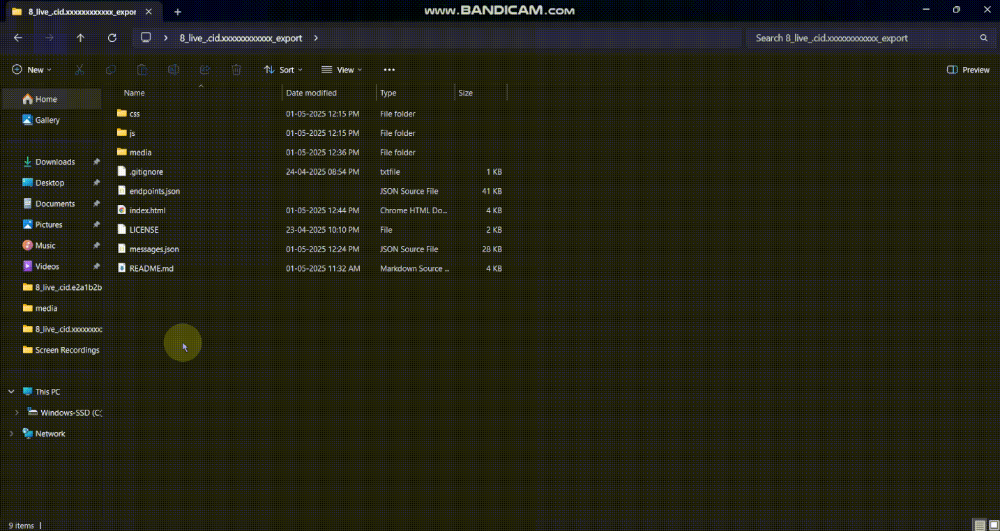
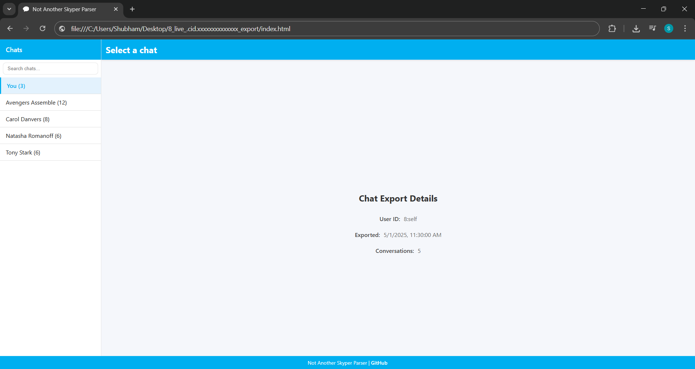
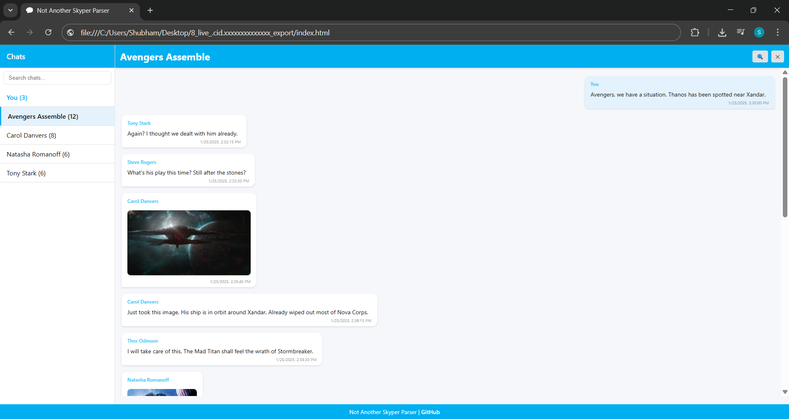
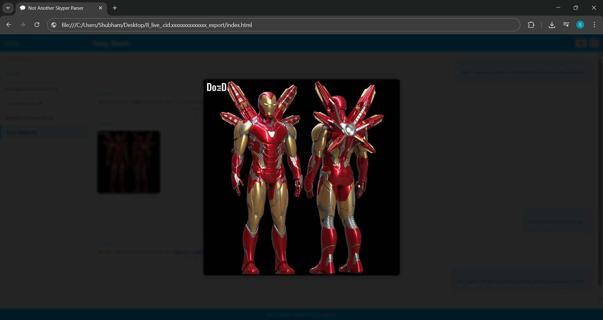

# Not Another Skyper Parser

A clean, modern viewer for Skype chat exports with enhanced search capabilities and media display.

## Setup Instructions

1. [Request an export](https://secure.skype.com/en/data-export) of your Skype conversations.
2. Download your Skype export when it becomes available.
3. Extract the downloaded TAR file:
   - On Windows, you can use the free [7-zip](https://www.7-zip.org/download.html) or similar tool
   - On Mac, you can double-click the file to extract it
4. Download the [source code zip](https://github.com/shubham-indalkar/not-another-skype-parser/archive/refs/heads/main.zip) and extract it to the same folder as your Skype export.

   For media to display correctly, your folder should look like this:
   ```
   📁 8_live_.cid.xxxxxxxxxxxx_export
   ├── 📁 css
   ├── 📁 js
   ├── 📁 media
   ├── 📄 .gitignore
   ├── 📄 endpoints.json
   ├── 📄 index.html
   ├── 📄 LICENSE
   ├── 📄 messages.json
   └── 📄 README.md
   ```

5. Open `index.html` in your browser.
6. Select the `messages.json` file when prompted.
7. Click "Load" to view your conversations.

## Preview

### App in Action



### Screenshots

| Home Screen | Conversation View | Media Preview |
|------------|-------------------|---------------|
|  |  |  |

## Why Use This Instead?

Compared to the official Skype export viewer, Not Another Skyper Parser offers significant improvements:

- **Better User Interface**: Modern, clean design that's easy to navigate versus the basic, outdated UI of the official parser
- **Advanced Search**: Quickly search through both conversations and messages, with real-time filtering
- **Improved Message Rendering**: Links are properly formatted and clickable, unlike the plain text in the official parser
- **Media Preview**: View images and videos directly within the interface with thumbnail and fullscreen options
- **Message Timestamps**: Clear, human-readable timestamps on all messages
- **Newest First**: Messages are sorted with newest at the bottom, making navigation more intuitive
- **Better Conversation Management**: Easily switch between conversations with a well-organized sidebar
- **Special Chat Handling**: "File Transfer" chats are labeled as "You" and starred chats as "Bookmarks" for better clarity
- **Responsive Design**: Works well on all screen sizes, unlike the fixed layout of the official viewer

## Usage

1. Open the application in your browser.
2. Load a Skype `messages.json` export file.
3. Browse conversations in the sidebar.
4. Search across conversations or within a specific chat.
5. Click on media to view it in a larger preview.

## Development

This application is built with vanilla JavaScript, HTML, and CSS, with no external dependencies. It's designed to run entirely in the browser with no server requirements.

### Project Structure

- `index.html` - Main application HTML
- `css/style.css` - Application styling
- `js/main.js` - Core application logic

## License

MIT License - See LICENSE file for details.

## Credits

Created by Shubham Indalkar - Not Another Skyper Parser
